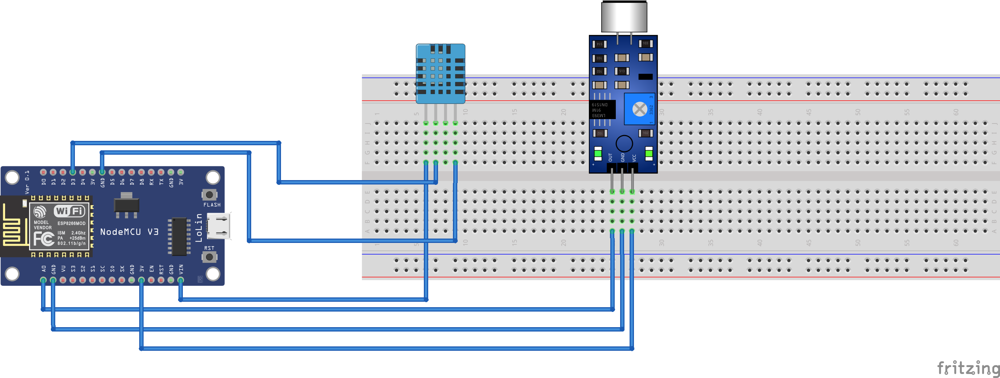

# Project: Room Metrics Tracker

**Author:** Vedat Öztürk  
**Email:** ozturkvedat72@gmail.com  
**Date:** 25/05/2024  
**License:** Public Domain  

An IoT project that uses sensors to monitor environmental parameters, and sends email notifications when a decibel threshold is exceeded.

## Step 1: Installation

1. Login to the Arduino IoT Cloud platform and create a dashboard with variables: Humidity, Temperature, Noise.
2. Bind these variables to corresponding visualizations on your dashboard, e.g., a chart for noise, a gauge for temperature, and a percentage for humidity.
3. Open the project folder on the Arduino IoT Cloud platform.
4. Edit the `arduino_secrets.h` file with your Wi-Fi credentials and your Arduino IoT Cloud dashboard secret key.
5. Check the rest of the code in the header files/main code for compatibility errors.

## Step 2: Assemble the circuit

Assemble the circuit following the diagram:


## Step 3: Load the code

Upload the code contained in the `.ino` file to your NodeMCU ESP8266 board.

## Folder structure

```
IotProject_dec28a           => Arduino sketch folder
  ├── IotProject_dec28a.ino       => main Arduino file
  ├── arduino_secrets.h           => header file for credentials
  ├── sketch.json                 => JSON file for Cloud
  └── thingProperties.h           => header file for binding the Cloud service to the main code
assets                      => Contains image files
IotProj.fzz                 => Fritzing file of circuit (if you want to edit the circuit on Fritzing software)
README.md                   => this file 
```

## Materials you need for this project

- Arduino NodeMCU ESP8266
- DHT-11 Temperature/Humidity Sensor
- LM-393 Sound Sensor
- Jumper Cables
- Resistor (for DHT-11)

## Circuit Live Example

